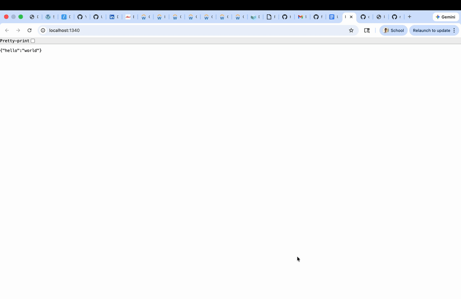

# Flask on Docker, Postgres, Gunicorn, and Nginx

A Dockerized Flask web application built with a production-style multi-service architecture. The project uses Flask for the application layer, Postgres for persistence, Gunicorn as the WSGI server, and Nginx as the reverse proxy and static/media file server. It includes image upload and retrieval, shared Docker volumes, and separate development and production-style configurations.

## Demo



## Overview

This project extends a standard Flask plus Docker setup into a more realistic deployment pattern. Instead of running a single lightweight container, the application is separated into dedicated services for the web app, database, and reverse proxy. This structure reflects how modern web systems are deployed while remaining compact enough to understand end to end. The app supports image upload and media serving, which demonstrates coordination across Flask, Nginx, Docker volumes, and environment-based configuration.

## Tech Stack

- **Backend:** Flask
- **Database:** Postgres
- **App Server:** Gunicorn
- **Reverse Proxy:** Nginx
- **Containerization:** Docker, Docker Compose
- **Language:** Python

## Features

- Multi-container Flask application
- Development and production-style Docker Compose setups
- Postgres-backed configuration
- Gunicorn-based production serving
- Nginx reverse proxy routing
- Static file serving
- Image upload and media retrieval
- Shared Docker volumes for static and uploaded assets
- Environment-based configuration with safe example files

## Architecture

The application is split across three main services:

- **web**  
  Flask application container responsible for routing, upload handling, and database integration.

- **db**  
  Postgres container used for persistence and environment-driven database configuration.

- **nginx**  
  Reverse proxy container that forwards application traffic to Gunicorn and serves static and media files efficiently.

## Project Structure

- `docker-compose.yml` for development
- `docker-compose.prod.yml` for production-style deployment
- `services/web/` for the Flask application and Dockerfiles
- `services/nginx/` for Nginx configuration
- `.env.dev` for development configuration
- `.env.prod.example` and `.env.prod.db.example` as safe production templates

## Development Setup

Start the development stack with:

```bash
docker compose up -d --build
